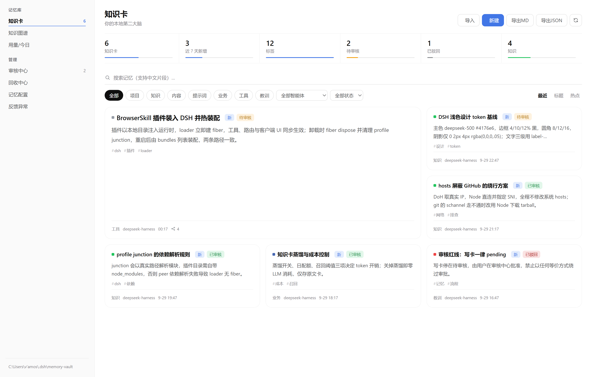
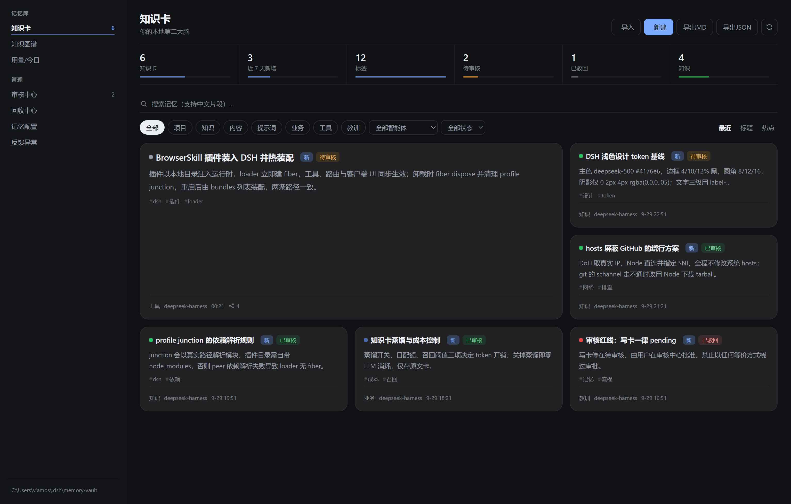
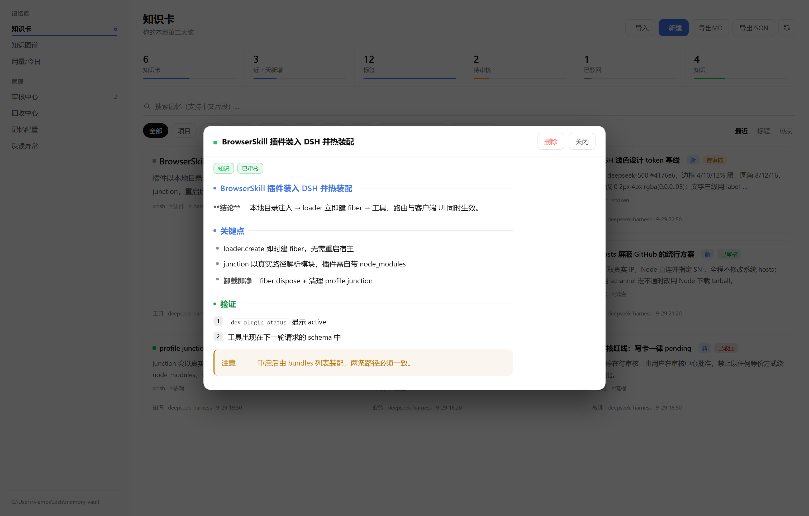
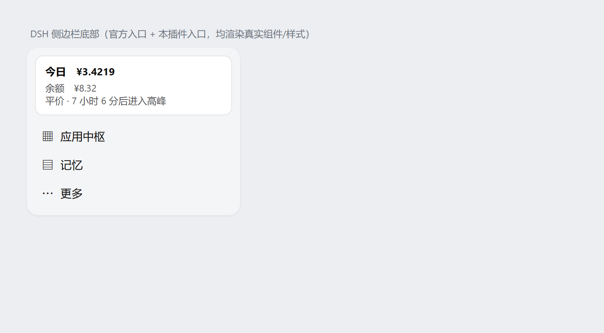
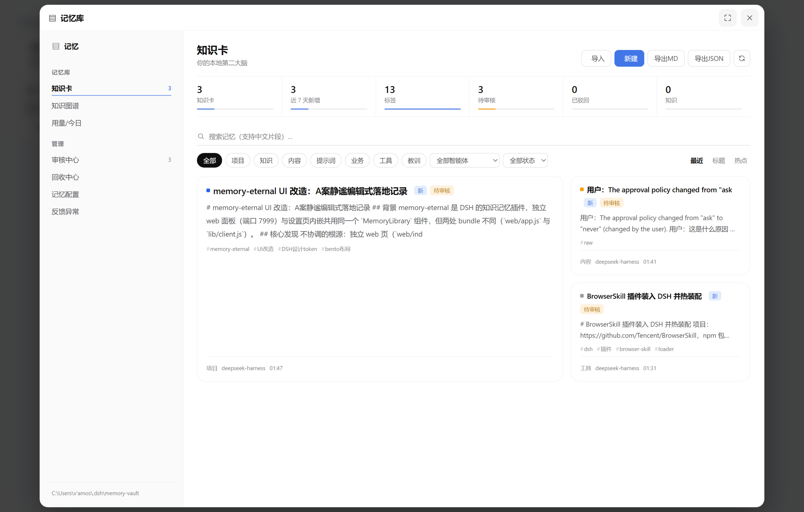

# memory-eternal · UI restyle

[DeepSeek Harness](https://github.com/deepseek-ai/deepseek-harness) 记忆插件
[**memory-eternal**](https://github.com/EternalNight996/memory-eternal) 的**界面重构衍生版**。

上游把「对话自动沉淀成知识卡、需要时按需召回」这件事做完了。本仓库只做一件事：
**把它的界面重做到与 DSH 主界面同一种视觉语言**——细线、留白、克制的状态色，
不再有彩色渐变边条、emoji 图标和重阴影。

> 功能、数据格式、host 逻辑与上游**完全一致**。本仓库不新增功能、不改变任何运行行为，
> 也不修改任何存储格式。

| | |
|---|---|
| 原作者 | **EternalNight996** |
| 上游仓库 | https://github.com/EternalNight996/memory-eternal |
| 对应版本 | `0.9.15`（标签 `v0.9.15-restyle.1`） |
| 许可 | MIT License（`LICENSE` 原文与版权行未改动） |
| 在线预览 | https://07vvvv.github.io/memory-eternal-ui-restyle/ |

---

## 界面

浅色（知识卡）：大纲式侧栏、进度条指标、下划线搜索、bento 卡片（首卡跨 2×2）



深色主题：状态色与主按钮随主题自适应



卡片阅读器：小标题用 CSS 色点、引用块用 2px 色条



侧边栏入口（与官方「应用中枢」同款行）与弹窗标题条：





---

## 这个版本改了什么

改动集中在客户端展示层，共 4 个源文件：

| 文件 | 改动量 | 内容 |
|---|---|---|
| `src/client/index.tsx` | +423 / −291 | 主界面与各面板的样式与结构 |
| `src/client/markdown.js` | +24 / −22 | 卡片正文排版：去 emoji，改 CSS 色点/色条 |
| `web/index.html` | +53 / −19 | 独立 web 页色板 → DSH 官方设计 token |
| `tests/markdown.test.mjs` | +12 / −12 | 断言随渲染器同步 |

构建产物随之重建：`lib/client.js`、`web/app.js`。

### 设计语言

主色 `--dsw-alias-state-business-primary`（#4176e6），三级文字用
`label-primary/secondary/tertiary`，边框统一 4% / 10% / 12% 黑，圆角 8/12/16，
阴影收敛到 `0 2px 8px rgba(0,0,0,.04)` 级别；状态色用 `color-mix` 自适应深浅主题。
**独立 web 页原先自带一套手写的旧 Tailwind 色板**（`#1f2937` / `#e5e7eb` / `#3b82f6`），
与宿主不一致——这是"看起来不像 DSH"的根源，现已替换为官方浅色与深色两套 token。

### 布局

- 侧栏改为 244px 大纲式导航：分组标题 + 行项 + 计数徽标 + 品牌头，选中态加粗 + 主色下划线
- 新增页头（标题 + 动作组），指标改为通栏进度条式，搜索改为无边框下划线，分类/排序改为 pill 行
- 卡片改为编辑式排版；卡片数为 3 的倍数时启用 bento（首卡跨 2×2，`grid-auto-flow: dense`，无空格）

### 入口与弹窗

- 侧边栏入口原本是橙色渐变 SVG，与相邻的官方线性图标不是一套语言；现改为与官方
  「应用中枢 / 插件市场」同款行：36px 高、9px 圆角、16px 几何符号 `▤`、
  hover 用 `--dsw-alias-interactive-bg-hover`
- 弹窗右上角原先是 26px 半透明浮条浮在 iframe 上方（容易与窗口控制按钮混淆、误点）；
  现改为 48px 标题条 + 34px SVG 图标按钮，不遮挡内容

### 正文与深色

- 卡片正文的小标题与引用块不再注入 emoji，改由 CSS 色点与 2px 色条承担视觉锚点；
  色组全部收敛到 DSH token（绿 / 琥珀 / 主色蓝 / 中性 / 红）
- 深色主题下主按钮文字改用 `--dsw-alias-label-primary-inverted`，修掉「浅蓝底 + 白字」的对比不足

---

## 什么**没有**改

- `index.js`：host 侧全部行为——自动沉淀、LLM 蒸馏、`memory_recall` 召回、
  `/memory-eternal/api/*` 路由、设置 schema
- `lib/*`：`db.js`、`vault.js`、`capture.js`、`api.js`、`watchdog.js`、`setup.js` 等 host 模块
- `cordis.patch.yml`、依赖声明与 npm 脚本
- 数据与存储：知识库仍在本地 `~/.dsh/memory-vault`，格式未变，可直接与上游互换

---

## 安装

**方式一：从本仓库安装（DSH 桌面版 profile 名为 `desktop`）**

```bash
dsh plugin --profile desktop add github:07vvvv/memory-eternal-ui-restyle
```

**方式二：用 Release 附件**

从 [Releases](https://github.com/07vvvv/memory-eternal-ui-restyle/releases) 下载
`memory-eternal-ui-restyle-0.9.15.tgz`，解压后构建，再把它 link 进 profile：

```bash
tar -xzf memory-eternal-ui-restyle-0.9.15.tgz
cd memory-eternal
npm install          # 只为拿 esbuild
node build.mjs       # 产出 lib/client.js 与 web/app.js
```

**方式三：本地开发**

把仓库目录直接 link 进 profile 的 `dependencies` 与 `dsh.profile.bundles` 即可热装配；
注意 junction 会以**真实路径**解析模块，插件目录需要自带 `node_modules`（放
`@deepseek-ai/dsh-tools`、`schemastery` 等），否则 loader 建不出 fiber。

---

## 从源码构建

需要 Node 22+（构建用到 `esbuild`）：

```bash
npm install
node build.mjs                    # 客户端：lib/client.js（DSH 内嵌）、web/app.js（独立页）
node tests/markdown.test.mjs      # 7/7
node tests/graph-lod.test.mjs     # 5/5
```

`src/client/index.tsx` 是界面源码（DSH 内嵌与独立 web 共用同一套组件），
`lib/client.js` 与 `web/app.js` 都是构建产物——**不要直接改产物**。

---

## 与上游的关系

- 上游更新了 **host 逻辑**：直接覆盖 `index.js` / `lib/` 即可，与本仓库改动不冲突
- 上游更新了 **UI**：需要手动合并，本仓库改动集中在
  `src/client/index.tsx`、`src/client/markdown.js`、`web/index.html`
- 想退回上游界面：用上游同名文件覆盖上述 4 个文件后重新 `node build.mjs`

功能说明、配置项、CLI、MCP 挂载等完整文档请以上游
[README](https://github.com/EternalNight996/memory-eternal#readme) 为准——本仓库不再重复维护一份。

---

## 许可与致谢

MIT License。上游项目及全部核心能力版权归原作者 **EternalNight996** 所有；
本仓库仅重构客户端界面层，不隶属上游官方发布，也不代表原作者立场。
改动明细见 [`NOTICE.md`](NOTICE.md)。
